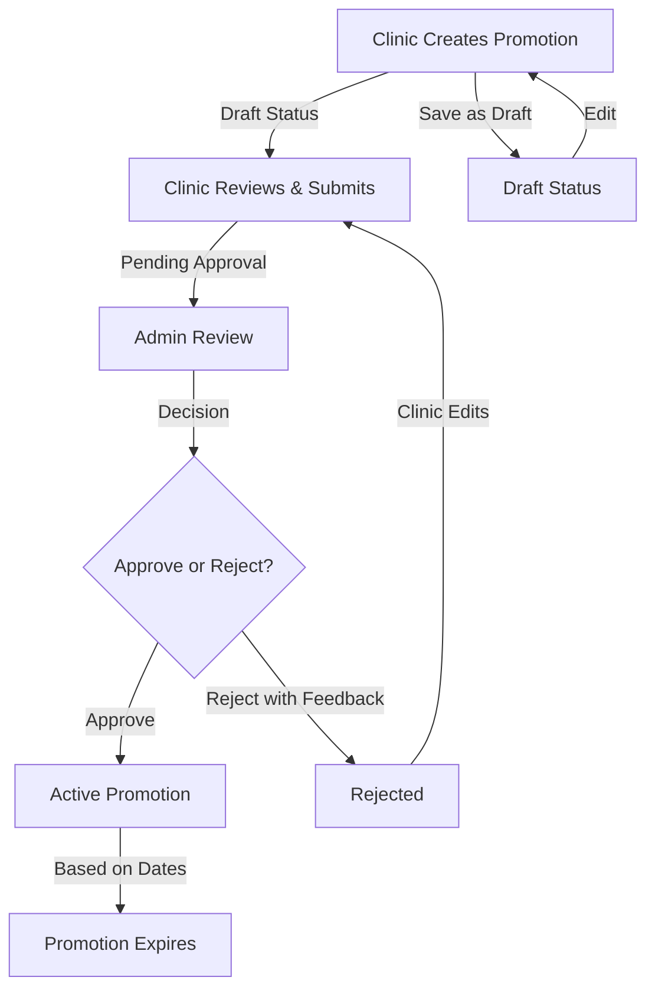

# Clinic-Initiated Promotions System

## Overview

The Clinic-Initiated Promotions system empowers clinics to create and manage their own promotional offers directly through their clinic portal. These clinic-created promotions undergo admin review and approval before becoming active on the MyDentalFly platform.

## Process Flow



### 1. Creation in Clinic Portal

- Clinic staff create promotion drafts through their dedicated portal
- They configure all details including:
  - Promotion type (discount or package)
  - Treatments included and quantities
  - Regular vs. promotional pricing
  - Additional benefits (hotel stay, tourist attractions)
  - Validity period and usage limits
- Promotions are saved with "DRAFT" status until submitted

### 2. Submission Process

- Clinic reviews the promotion details and submits for approval
- Promotion status changes to "PENDING_APPROVAL"
- Admin team receives notification of new promotion awaiting review
- Clinic can track the status of their submission in their dashboard

### 3. Admin Review

- Admins review all pending promotions through a dedicated interface
- They verify:
  - Pricing accuracy and value proposition
  - Treatment combinations and medical appropriateness
  - Alignment with platform policies and guidelines
  - Marketing claims and promises
- Admins can approve, reject with feedback, or modify before approving

### 4. Activation

- Upon approval, promotion status changes to "APPROVED"
- When start date arrives, status automatically changes to "ACTIVE"
- Clinic receives notification when promotion status changes
- Active promotions appear on the platform according to their configuration
- Performance metrics become available in the clinic dashboard

## Clinic Portal Features

### Promotion Management Dashboard

The clinic portal includes a comprehensive "Promotions" section where staff can:

1. **Create New Promotions**
   - Select promotion type (discount or package)
   - Configure all details with an intuitive form interface
   - See real-time preview of how it will appear to patients
   - Calculate savings and value proposition

2. **Manage Existing Promotions**
   - View all promotions with color-coded status indicators
   - Filter by status (Draft, Pending, Approved, Active, Expired, Rejected)
   - Sort by creation date, start date, or performance metrics
   - Edit drafts or rejected promotions
   - Deactivate active promotions if needed

3. **Promotion Analytics**
   - Track key performance indicators:
     - Views: How many patients viewed the promotion
     - Applications: How many applied the promo code
     - Conversions: How many completed their booking
     - Revenue: Total revenue generated from the promotion
   - View trends over time with visual charts
   - Compare multiple promotions side-by-side
   - Export reports for offline analysis

## Admin Approval Interface

The admin portal includes a dedicated "Promotion Approvals" section where administrators can:

1. **Review Pending Promotions**
   - View a queue of all pending promotions
   - Sort by clinic reputation, submission date, or promotion value
   - See full details of each promotion
   - Compare with platform guidelines and similar promotions

2. **Approval Actions**
   - Approve as submitted (no changes)
   - Edit specific details before approval
   - Reject with detailed feedback
   - Request clarification from the clinic

3. **Bulk Processing**
   - Select multiple promotions for batch actions
   - Apply standard approval/rejection templates
   - Prioritize queue based on clinic tier or urgency

## Technical Implementation

### Data Structure

```typescript
interface PromoCode {
  // Existing fields
  id: string;
  code: string;
  title: string;
  description: string;
  clinic_id: string;
  discount_type: "percentage" | "fixed_amount";
  discount_value: number;
  applicable_treatments: string[];
  start_date: string;
  end_date: string;
  max_uses: number;
  is_active: boolean;
  type: "discount" | "package";
  packageData?: {...};
  
  // New workflow fields
  status: "DRAFT" | "PENDING_APPROVAL" | "APPROVED" | "ACTIVE" | "REJECTED" | "EXPIRED";
  submittedBy: string;        // Clinic user ID
  submittedDate: string;      // ISO date string
  reviewedBy?: string;        // Admin user ID
  reviewedDate?: string;      // ISO date string
  rejectionReason?: string;   // Admin feedback
  approvalNotes?: string;     // Admin notes
  version: number;            // For tracking edits
}

interface PromoCodeAnalytics {
  promoId: string;            // Reference to promo code
  views: number;              // How many saw it
  applications: number;       // How many applied it
  completedBookings: number;  // How many booked with it
  revenue: number;            // Total revenue generated
  lastUpdated: string;        // ISO date string
}
```

### API Endpoints

#### Clinic API Endpoints

| Endpoint | Method | Description |
|----------|--------|-------------|
| `/api/clinic/promotions` | GET | List all promotions for the clinic |
| `/api/clinic/promotions` | POST | Create a new promotion draft |
| `/api/clinic/promotions/:id` | GET | Get specific promotion details |
| `/api/clinic/promotions/:id` | PUT | Update a draft promotion |
| `/api/clinic/promotions/:id` | DELETE | Delete a draft promotion |
| `/api/clinic/promotions/:id/submit` | POST | Submit for approval |
| `/api/clinic/promotions/analytics` | GET | Get promotion performance data |

#### Admin API Endpoints

| Endpoint | Method | Description |
|----------|--------|-------------|
| `/api/admin/promotions/pending` | GET | List pending approvals |
| `/api/admin/promotions/:id` | GET | Get specific promotion details |
| `/api/admin/promotions/:id` | PUT | Update pending promotion |
| `/api/admin/promotions/:id/approve` | PUT | Approve promotion |
| `/api/admin/promotions/:id/reject` | PUT | Reject with feedback |

### Required UI Components

#### Clinic Portal Components

1. **PromotionDashboard**
   - List view with filterable, sortable promotions
   - Status badges and quick action buttons
   - Summary metrics and creation button

2. **PromotionEditor**
   - Multi-step form for creating/editing promotions
   - Treatment selector with pricing calculator
   - Date range picker with calendar visualization
   - Preview panel showing patient-facing design

3. **PromotionAnalytics**
   - Performance charts and trend graphs
   - Comparison tools for multiple promotions
   - Export functionality for reports

#### Admin Portal Components

1. **ApprovalQueue**
   - Sortable list of pending promotions
   - Priority indicators and clinic reputation score
   - Quick approval buttons for simple cases

2. **PromotionReviewer**
   - Side-by-side comparison with guidelines
   - Editing interface for making adjustments
   - Standardized feedback options for rejections

## Implementation Plan

### Phase 1: Core Functionality
- Extend database schema with workflow status fields
- Create basic CRUD operations for clinic promotions
- Implement submission and approval workflow
- Build notification system for status changes

### Phase 2: Enhanced Features
- Add analytics tracking and reporting
- Implement promotion preview functionality
- Create comparison tools for admins
- Add bulk processing capabilities

### Phase 3: Optimization
- Implement AI-assisted promotion suggestions
- Add automated validation against platform guidelines
- Create performance prediction tools
- Develop A/B testing capabilities for clinics

## Security and Validation

### Data Validation
- Server-side validation for all promotion submissions
- Price range constraints based on treatment types
- Date validation for proper scheduling
- Treatment validation against clinic's approved list

### Access Control
- Clinic users can only manage their own promotions
- Admin approval requires specific permissions
- Comprehensive audit logging of all activities
- Rate limiting to prevent abuse

## Best Practices for Clinics

1. **Create Valuable Packages**
   - Focus on genuine value, not just discounts
   - Bundle complementary treatments that make clinical sense
   - Add unique benefits that differentiate from competitors

2. **Clear Description**
   - Use concise, compelling descriptions
   - Clearly state what's included and excluded
   - Highlight the savings or benefits prominently

3. **Strategic Timing**
   - Schedule promotions during typically slower periods
   - Plan submission to allow for approval time
   - Consider seasonal factors (tourist seasons, holidays)

4. **Monitor Performance**
   - Regularly check analytics for each promotion
   - Identify which offerings resonate with patients
   - Adjust future promotions based on performance data

## Admin Review Guidelines

1. **Consistency Check**
   - Ensure pricing is consistent with platform guidelines
   - Verify that treatments are appropriate combinations
   - Check that marketing claims are accurate and ethical

2. **Value Verification**
   - Confirm genuine savings for patients
   - Verify that package benefits are clearly stated
   - Ensure the promotion creates real value

3. **Quality Control**
   - Check for spelling and grammatical errors
   - Verify that images meet platform standards
   - Ensure descriptions are clear and accurate

---

*This document outlines the complete workflow and implementation details for the Clinic-Initiated Promotions system within the MyDentalFly platform.*