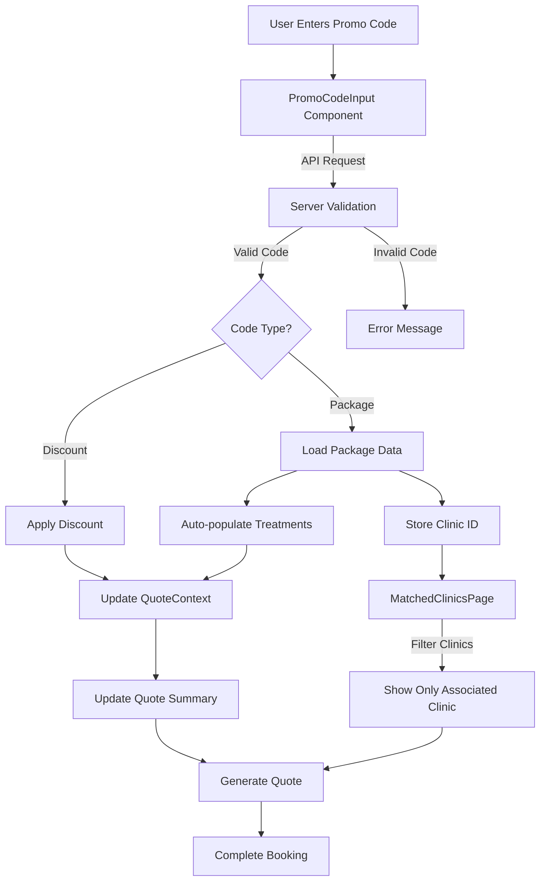

# MyDentalFly Promo Code System Flow Diagram



## Promo Code System - Detailed Flow

### 1. User Input Phase
- **User enters promo code**: Through the `PromoCodeInput` component on the treatment selection page
- **Client-side validation**: Basic format checking before sending to server
- **API request**: Code is sent to `/api/promo-codes/validate/:code` endpoint

### 2. Server Validation Phase
- **Code lookup**: Server checks if the code exists in the database
- **Validation checks**: 
  - Is the code active?
  - Has it expired?
  - Has it reached usage limits?
- **Response data**: 
  - For discounts: type (percentage/fixed) and value
  - For packages: complete treatment list, pricing, and clinic association

### 3. Processing Phase
- **Discount codes**: 
  - Calculate discount amount
  - Update QuoteContext with discount information
  - Display savings in the quote summary
- **Package codes**:
  - Auto-populate the treatment list
  - Store package details in QuoteContext
  - Save clinic ID in session storage

### 4. Clinic Filtering Phase (for packages)
- **MatchedClinicsPage component**: 
  - Reads promo code and clinic ID from session storage
  - Maps specific promo codes to specific clinics (e.g., IMPLANT2023 → DentSpa)
  - Filters the clinic list to only show the associated clinic
  - Sets pricing based on the clinic's price factor

### 5. Quote Generation Phase
- **Quote summary**: Shows the applied promo code and savings amount
- **Treatments**: Lists all treatments (auto-populated for packages)
- **Clinic selection**: Pre-selected for package codes
- **Final price**: Calculated with applied discounts

## Component Interactions

### PromoCodeInput Component
```jsx
<PromoCodeInput
  onApplyCode={(code, data) => {
    // Handle code application
    if (data.isPackage) {
      // Handle package data
    } else {
      // Handle discount
    }
  }}
/>
```

### QuoteContext
```jsx
// Within QuoteContext
const applyPromoCode = (code, data) => {
  dispatch({
    type: 'set_promo_code',
    payload: {
      code,
      discountType: data.discountType,
      discountValue: data.discountValue,
      isPackage: data.isPackage,
      packageData: data.packageData,
      clinicId: data.clinicId
    }
  });
};
```

### MatchedClinicsPage
```jsx
// Within MatchedClinicsPage
useEffect(() => {
  const pendingPromoCode = sessionStorage.getItem('pendingPromoCode');
  
  // Map codes to specific clinics
  if (pendingPromoCode === 'IMPLANT2023') {
    const dentSpaClinic = clinics.find(c => c.id === 'dentspa');
    if (dentSpaClinic) {
      setFilteredClinics([dentSpaClinic]);
    }
  }
  // Other code mappings...
}, []);
```